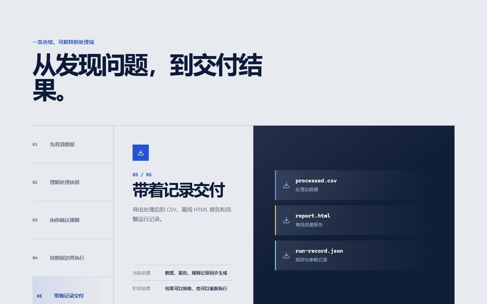
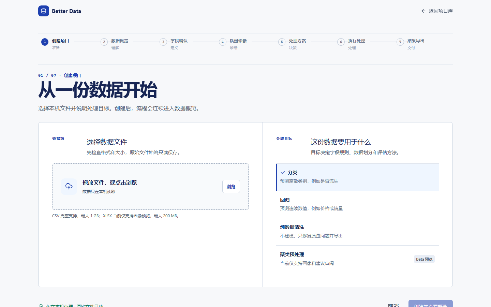
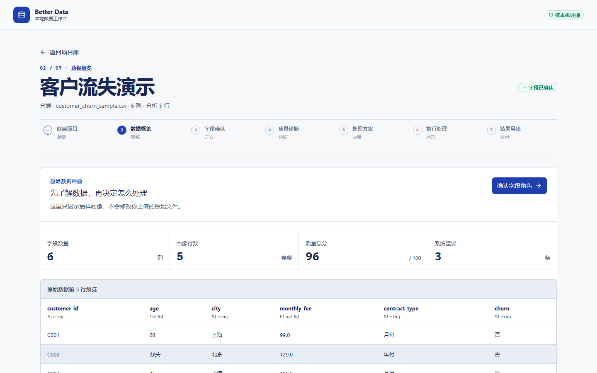
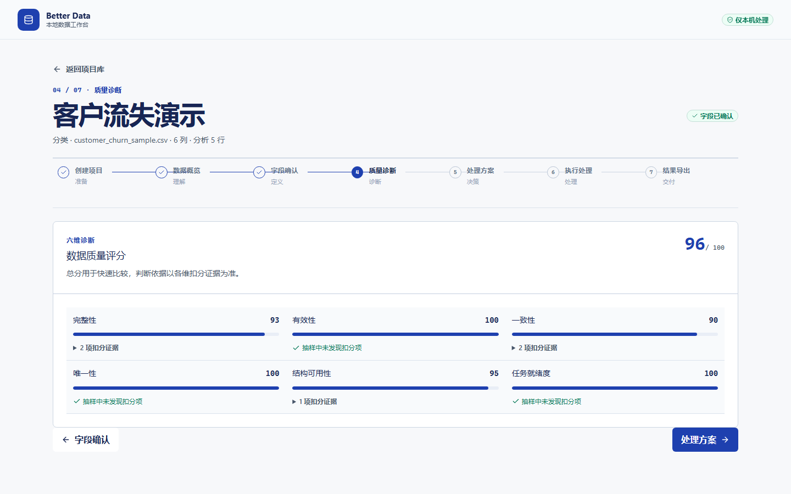
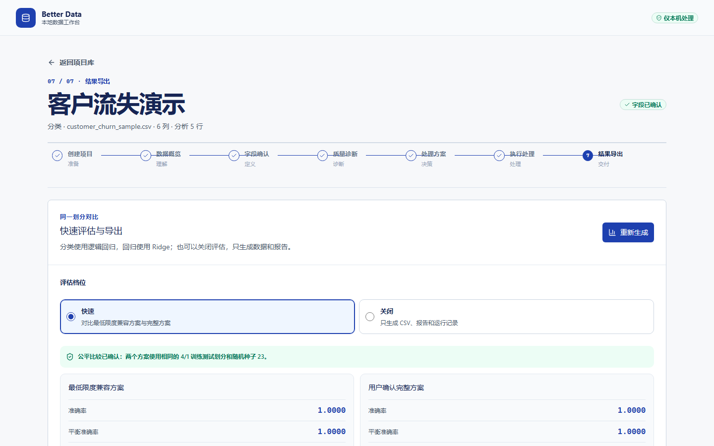

# Better Data

Better Data 是面向数据分析人员的 Windows 本地数据预处理工作台。它把数据检查、字段确认、规则审阅、安全处理、快速评估和结果导出组织为一条可追踪的工作流，实际数据始终由本机后端处理。

当前稳定版本：[`v0.1.1`](https://github.com/windgogo-qzj/better-data/releases/tag/v0.1.1)


## 为什么使用 Better Data

- **先看清问题**：定位缺失值、重复记录、类型异常和类别不一致。
- **建议有依据**：展示证据、风险、置信度、预计影响和备选方案。
- **决定权在用户**：字段角色与处理规则由数据人员确认，系统不擅自修改。
- **严格控制边界**：监督学习任务先划分数据，只在训练集学习处理参数。
- **结果可以复核**：导出处理后 CSV、离线 HTML 报告和完整运行记录。
- **默认本地处理**：原始文件只读保存，不上传外部服务。



## 当前能力

| 能力 | `v0.1.1` 支持情况 |
| --- | --- |
| CSV 导入 | 完整支持；自动识别逗号、分号、TAB 和竖线分隔符 |
| CSV 编码 | UTF-8、UTF-8 BOM、GB18030、Windows-1252 |
| XLSX 导入 | 支持画像和建议预览；执行前需转换为 CSV |
| 任务类型 | 分类、回归、纯数据清洗；聚类预处理为预览能力 |
| 数据画像 | 字段类型、缺失、唯一值、抽样边界和前五行预览 |
| 字段与质量 | 12 种字段角色、六维质量评分、可追溯扣分证据 |
| 处理 | 缺失值、重复值、类别编码、未知类别、缩放和常量筛选 |
| 评估 | 分类逻辑回归、回归 Ridge；处理前后使用同一数据划分 |
| 导出 | UTF-8 BOM CSV、无外链离线 HTML 报告、运行记录与哈希 |
| 项目管理 | 搜索、移入回收站、撤销、恢复和永久删除 |

完整产品边界见[需求规格](docs/requirements.md)，后续计划见[开发路线图](docs/roadmap.md)。

## 快速开始

### 1. 环境要求

- Windows 10 或 Windows 11
- Node.js 22.13 或更高版本
- pnpm 11
- Python 3.12

### 2. 安装依赖

```powershell
pnpm install
python -m venv .venv
.\.venv\Scripts\python.exe -m pip install -e ".\backend[dev]"
```

### 3. 启动本地服务

打开两个 PowerShell 窗口，在仓库根目录分别执行：

```powershell
# 窗口一：本地 API
.\.venv\Scripts\python.exe -m uvicorn better_data.main:app --host 127.0.0.1 --port 8000
```

```powershell
# 窗口二：产品界面
pnpm dev
```

浏览器访问 `http://localhost:5173`。本地 API 文档位于 `http://127.0.0.1:8000/api/docs`。

> 前端开发服务器监听 `localhost`。如果 `http://127.0.0.1:5173` 无法访问，请使用上面的 `localhost` 地址。

## 如何使用

### 创建项目

1. 从首页选择“开始整理数据”。
2. 在项目库中选择“新建项目”。
3. 输入可识别的项目名，选择本机 CSV 或 XLSX 文件。
4. 选择分类、回归、纯数据清洗或聚类预处理。
5. 确认格式与能力边界后创建项目。



文档中的操作截图全部来自同一个脱敏演示项目：项目名为“客户流失演示”，数据文件为 `customer_churn_sample.csv`。演示数据位于 `backend/tests/fixtures/`，不包含用户业务数据。

### 完成七阶段工作流

Better Data 始终使用同一套七阶段导航，创建前后不会改变步骤数量：

1. **创建项目**：复制原始文件并生成初始画像。
2. **数据概览**：检查字段数、画像行数、质量总分、警告和原始预览。
3. **字段确认**：确认 ID、连续数值、类别、目标、忽略等字段角色。
4. **质量诊断**：查看扣分证据、影响字段和稳定规则编号。
5. **处理方案**：审阅建议、风险、替代方案和预计影响。
6. **执行处理**：使用固定随机种子处理；监督学习任务只在训练集拟合参数。
7. **结果导出**：比较处理前后结果，下载 CSV 与离线 HTML 报告。





### 查看与导出结果

结果页记录任务类型、划分方式、随机种子和评估指标。分类与回归可以选择快速评估或关闭评估；关闭评估时仍会生成数据、报告和运行记录。纯数据清洗不创建训练测试划分，直接导出全量处理结果。



HTML 报告是无脚本、无外链的单文件，可以离线查看。下载接口只开放固定的结果白名单，不接受任意路径。

### 管理项目与回收站

- 项目库支持按项目名或文件名搜索。
- 普通删除会把完整项目目录移入回收站，并提供撤销入口。
- 回收站中的项目可以恢复，恢复时保留原项目 ID。
- 永久删除需要再次确认；服务端会校验项目 ID 和目标目录边界。
- 正在运行的项目不能删除，避免中间状态损坏。

## 数据保存与隐私

默认项目库位于仓库的 `backend/work/projects/`。首次运行可以在设置中选择其他绝对路径；系统只接管空目录、已有 Better Data 标记的项目库或可识别的旧项目库。

```text
<项目库>/<project-id>/
├─ project.json            项目状态
├─ analysis.json           字段、评分与建议
├─ pipeline-config.json    最近一次处理配置
├─ source/                 只读原始文件副本
├─ working/                Parquet 中间数据
├─ results/                评估结果
├─ reports/                离线报告
├─ exports/                可下载结果
└─ logs/                   运行记录
```

`backend/work/`、本地项目库和导出结果已被 Git 忽略。不要把真实数据、字段样例、日志、访问令牌或密钥提交到 Issue、Pull Request 或仓库。

## 开发与验证

```powershell
# 前端静态检查与生产构建
pnpm lint
pnpm build

# 后端测试
Set-Location backend
..\.venv\Scripts\python.exe -m pytest -q

# 返回仓库根目录后检查差异格式
Set-Location ..
git diff --check
```

GitHub Actions 会在 Windows 环境重新执行前端检查、生产构建和后端测试。所有质量门禁通过后才能合并到 `main`。

### 更新 README 截图

先使用 `backend/tests/fixtures/customer_churn_sample.csv` 创建并完成一个名为“客户流失演示”的项目，然后执行：

```powershell
node scripts/capture-readme.mjs --project-id <演示项目 ID>
```

脚本使用固定 1440×900 视口，从真实页面生成首页、产品流程、新建项目、数据概览、质量诊断和最终结果截图。截图完成后应删除演示项目，避免污染本机项目库。

## 仓库结构

```text
app/ + components/   React 页面、业务界面与通用组件
backend/             FastAPI、本地存储、处理与评估逻辑
docs/                需求、架构、路线图、决策与开发记录
.github/              Issue、Pull Request 与 Actions 规范
scripts/              安装辅助和可重复执行的工程脚本
```

- [仓库导览](docs/repository-guide.md)
- [系统架构](docs/architecture.md)
- [产品需求规格](docs/requirements.md)
- [开发路线图](docs/roadmap.md)
- [开发日志](docs/development-log.md)
- [发布流程](docs/release-process.md)
- [参与开发](CONTRIBUTING.md)
- [更新记录](CHANGELOG.md)

## 版本与发布

版本号遵循语义化版本，仓库标签使用 `vX.Y.Z`，代码包版本使用 `X.Y.Z`。每个发布必须完成以下闭环：里程碑与 Release Issue、短生命周期分支、版本和文档更新、本地质量门禁、Pull Request、GitHub Actions、合并、带说明标签、GitHub Release 和发布后核验。

详细步骤及回滚要求见[发布流程](docs/release-process.md)。

## 许可证

当前暂不添加开源许可证。在明确许可证前，仓库内容不视为开放授权。
