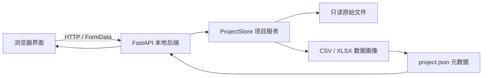

# Better Data 仓库导览

这份文档面向第一次阅读仓库的人，解释每个目录为什么存在、当前是否参与运行，以及修改某项功能时应该从哪里开始。

正式项目通常不会给每一个小目录都放一份重复的说明，而是采用三层文档：

1. 根目录 `README.md` 提供项目入口和快速地图。
2. 本文提供完整的仓库结构、数据流和修改路径。
3. `app/README.md`、`backend/README.md`、`components/README.md` 等在复杂模块旁提供就近说明。

## 1. 先理解整体运行方式



- 前端运行在 `http://127.0.0.1:5173`，负责配置、预览和展示。
- 后端运行在 `http://127.0.0.1:8000`，负责读取文件、数据分析和项目存储。
- 用户数据写入被 Git 忽略的 `work/projects/`，不会随源码提交到 GitHub。
- 当前核心路径不依赖云数据库、用户登录或外部服务。

## 2. 目录总览

| 目录 | 类型 | 作用 | 当前状态 | 日常是否修改 |
| --- | --- | --- | --- | --- |
| `.github/` | 开发基础设施 | Issue 模板、PR 模板和 GitHub Actions 持续集成 | 已启用 | 修改协作流程时 |
| `.openai/` | 运行支持 | Sites/Cloudflare 运行绑定配置；当前 `d1`、`r2` 均关闭 | 支持性配置 | 通常不改，不放密钥 |
| `app/` | 核心前端 | 页面、全局样式、根布局及预留的认证辅助函数 | 已启用 | 开发页面时经常修改 |
| `backend/` | 核心后端 | FastAPI、数据模型、项目文件管理、数据画像和测试 | 已启用 | 开发数据能力时经常修改 |
| `build/` | 构建支持 | 本项目使用的 Sites/Vite 构建插件及许可证 | 已启用 | 升级构建链时修改 |
| `components/` | 前端基础组件 | shadcn 风格的按钮、对话框、表单、表格等 UI 原语 | 已启用 | 扩展通用组件时修改 |
| `db/` | 可选脚手架 | Drizzle/D1 数据库入口与空 Schema | 当前核心流程未使用 | 启用 D1 后再修改 |
| `design-system/` | 设计资料 | UI/UX Pro Max 自动生成的原始设计建议 | 设计追溯用 | 重新生成设计系统时 |
| `docs/` | 项目文档 | 需求、架构、路线图、架构决策和仓库导览 | 已启用 | 行为或方案变化时修改 |
| `drizzle/` | 可选脚手架 | Drizzle 数据库迁移元数据 | 当前核心流程未使用 | 生成数据库迁移时 |
| `examples/` | 示例代码 | 可选 D1 数据库与 API 示例，不进入正式编译 | 参考用 | 不直接开发正式功能 |
| `hooks/` | 前端公共能力 | 可复用 React Hooks，目前包含移动端判断 | 按需使用 | 多页面共享逻辑时 |
| `lib/` | 前端公共能力 | 与界面无关的轻量工具，目前主要是 className 合并 | 已启用 | 添加通用工具时 |
| `public/` | 静态资源 | favicon、SVG 等可直接由浏览器读取的文件 | 已启用 | 添加静态资源时 |
| `scripts/` | 工程脚本 | CI 安装和本地 Sites/Cloudflare 运行环境准备 | 已启用 | 调整安装或启动流程时 |
| `vendor/` | 第三方源码 | 随仓库保存的 shadcn Tailwind 样式和许可证 | 已启用 | 仅在受控升级时修改 |

### 目录类型说明

- **核心代码**：直接决定用户看到什么、数据如何处理。
- **开发基础设施**：让安装、构建、测试和团队协作稳定运行。
- **可选脚手架**：模板已提供但当前业务尚未启用；不能当作真实依赖。
- **生成物**：由安装、构建、测试或运行产生，不应人工维护或提交。

## 3. 核心目录详解

### `app/`：浏览器界面

| 文件 | 用途 |
| --- | --- |
| `page.tsx` | 首页工作台；加载项目列表、打开创建项目对话框、上传文件并展示状态 |
| `projects/[projectId]/page.tsx` | 项目分析页；确认字段角色、查看六维质量评分和启停规则建议 |
| `layout.tsx` | HTML 根结构、中文语言标记、页面标题和 favicon |
| `globals.css` | 设计 Token、全局样式、组件状态、响应式布局和减少动效规则 |
| `chatgpt-auth.ts` | 脚手架保留的 ChatGPT 认证辅助函数；当前产品不涉及登录，未进入主流程 |

继续阅读：[前端模块说明](../app/README.md)。

### `backend/`：本地数据服务

```text
backend/
├─ src/better_data/
│  ├─ main.py              # FastAPI 应用与接口
│  ├─ config.py            # 路径、文件大小、抽样行数配置
│  ├─ models.py            # API 数据结构和状态枚举
│  └─ services/
│     ├─ project_store.py  # 项目创建、文件保存、元数据管理
│     ├─ analysis.py       # 字段推断、六维评分、规则建议与冲突判断
│     ├─ pipeline.py       # 训练测试划分、训练集拟合和工作数据生成
│     └─ profiling.py      # CSV/XLSX 读取与数据画像
├─ tests/                  # 自动化测试和合成测试数据
└─ pyproject.toml          # Python 包、依赖与测试配置
```

继续阅读：[后端模块说明](../backend/README.md)。

### `components/`、`hooks/`、`lib/`：前端共享层

- `components/ui/` 保存通用 UI 原语。页面优先组合这些组件，不重复实现按钮、对话框或表单控件。
- `hooks/` 保存与具体页面无关的 React 状态逻辑。
- `lib/` 保存无界面的通用函数；`lib/utils.ts` 中的 `cn()` 用于合并 Tailwind className。

继续阅读：[组件目录说明](../components/README.md)。

### `docs/` 与 `design-system/`：决策依据

- `docs/requirements.md`：产品要做什么。
- `docs/architecture.md`：系统如何实现。
- `docs/roadmap.md`：按什么顺序交付。
- `docs/decisions/`：不能只靠代码表达的重要架构决策。
- `uidesign.md`：当前前端必须遵循的项目级设计规范。
- `design-system/better-data/MASTER.md`：设计工具生成的原始建议，用于追溯，不直接覆盖项目级规范。

## 4. 根目录文件说明

| 文件 | 用途 | 修改建议 |
| --- | --- | --- |
| `README.md` | 项目主页、能力范围、启动方式和仓库入口 | 面向所有读者，保持简短 |
| `CONTRIBUTING.md` | 分支、Issue、PR、测试与数据安全规则 | 协作方式变化时更新 |
| `CHANGELOG.md` | 面向版本的功能变更记录 | 每个用户可感知变更都应更新 |
| `uidesign.md` | 配色、字体、间距、组件、响应式和可访问性规范 | 前端设计变化时先改规范再改代码 |
| `package.json` | Node 版本、前端依赖和命令 | 安装依赖或增加脚本时修改 |
| `pnpm-lock.yaml` | 前端依赖的精确版本锁定 | 由 pnpm 维护，不手写 |
| `pnpm-workspace.yaml` | pnpm 工作区配置 | 仓库拆分多包时修改 |
| `vite.config.ts` | Vinext、Sites 和 Cloudflare 本地运行插件 | 调整构建或开发服务器时修改 |
| `next.config.ts` | Next.js/Vinext 兼容配置 | 需要框架配置时修改 |
| `tsconfig.json` | TypeScript 严格检查、路径别名和编译范围 | 调整语言规则时修改 |
| `eslint.config.mjs` | 前端静态检查规则 | 调整代码质量规则时修改 |
| `postcss.config.mjs` | Tailwind/PostCSS 处理配置 | 调整 CSS 构建链时修改 |
| `components.json` | shadcn 组件生成器配置和路径别名 | 更新组件生成策略时修改 |
| `drizzle.config.ts` | 可选 Drizzle 数据库迁移配置 | 启用数据库后修改 |
| `cloudflare-env.d.ts` | Cloudflare 绑定的 TypeScript 类型 | 通常由工具维护 |

## 5. 一次“创建项目”请求经过哪些代码

1. 用户在 `app/page.tsx` 选择 CSV 或 XLSX 并点击“创建并检查”。
2. 前端以 `FormData` 调用 `POST /api/projects`。
3. `backend/src/better_data/main.py` 校验接口参数并调用 `ProjectStore`。
4. `project_store.py` 创建项目目录、流式保存原始文件、计算 SHA-256，并阻止路径逃逸。
5. `profiling.py` 抽样读取表格，生成字段类型、缺失率、唯一值和示例等画像。
6. `analysis.py` 根据画像生成字段角色、六维评分、证据和带稳定编号的处理建议。
7. `ProjectRecord` 写入 `project.json`，字段与规则分析写入 `analysis.json`。
8. 前端更新项目列表，并允许进入项目分析页继续确认。

## 6. 想修改某项功能时从哪里开始

| 目标 | 首先查看 | 通常还会涉及 |
| --- | --- | --- |
| 修改首页布局或文案 | `app/page.tsx` | `app/globals.css`、`uidesign.md` |
| 修改字段质量工作台 | `app/projects/[projectId]/page.tsx` | `services/analysis.py`、`models.py`、`app/globals.css` |
| 修改颜色、间距或组件状态 | `uidesign.md` | `app/globals.css`、`components/ui/` |
| 新增通用按钮或表单组件 | `components/ui/` | `components/README.md` |
| 新增 API | `backend/src/better_data/main.py` | `models.py`、`services/`、`tests/` |
| 修改文件大小或项目库路径 | `backend/src/better_data/config.py` | README、测试 |
| 修改 CSV/XLSX 数据画像 | `services/profiling.py` | `models.py`、测试数据、测试 |
| 修改项目目录与元数据 | `services/project_store.py` | `config.py`、`models.py`、测试 |
| 修改字段推断、评分或建议规则 | `services/analysis.py` | `models.py`、项目分析 API 测试、需求阈值 |
| 修改划分、填充、编码或缩放 | `services/pipeline.py` | `models.py`、防泄漏测试、项目分析页 |
| 调整 CI | `.github/workflows/ci.yml` | `package.json`、`pyproject.toml` |
| 记录架构取舍 | `docs/decisions/` | `docs/architecture.md` |
| 启用可选 D1 数据库 | `db/`、`drizzle.config.ts` | `.openai/hosting.json`、迁移、测试 |

## 7. 本地生成但不会提交的目录

这些目录可能出现在电脑中，但被 `.gitignore` 排除，GitHub 通常看不到：

| 目录 | 由什么产生 | 能否删除后重建 |
| --- | --- | --- |
| `node_modules/`、`.pnpm-store/` | pnpm 安装前端依赖 | 可以，重新运行 `pnpm install` |
| `.venv/` | Python 虚拟环境 | 可以，重新创建并安装依赖 |
| `.next/`、`.vinext/`、`dist/` | 前端开发或生产构建 | 可以，重新运行构建 |
| `.wrangler/`、`.sites-runtime/` | 本地 Cloudflare/Sites 运行环境 | 可以，会丢失本地模拟状态 |
| `work/` | Better Data 本地项目与用户数据 | **不要随意删除**；这是用户工作数据 |
| `coverage/`、`.pytest_cache/`、`__pycache__/` | 测试和 Python 运行缓存 | 可以，重新测试时生成 |

不要通过删除整个项目目录来“清理缓存”。如果只想清理构建结果，应准确删除可重建目录，并保留 `work/`。

## 8. 阅读代码的推荐顺序

第一次进入项目时，按以下顺序阅读最省力：

1. `README.md`：理解产品目标和启动方式。
2. `docs/requirements.md`：理解 v1.0 范围。
3. `docs/architecture.md`：理解前后端边界与本地优先原则。
4. `app/page.tsx`：观察用户操作如何发起请求。
5. `backend/src/better_data/main.py`：找到对应 API。
6. `services/project_store.py` 和 `services/profiling.py`：理解核心业务处理。
7. `backend/tests/` 与 `.github/workflows/ci.yml`：理解功能如何被验证。

## 9. 提交前最低检查

```powershell
pnpm lint
pnpm build
Set-Location backend
..\.venv\Scripts\python.exe -m pytest
```

同时确认：没有提交 `work/`、真实用户数据、`.env`、访问令牌、密钥或本地生成物。
